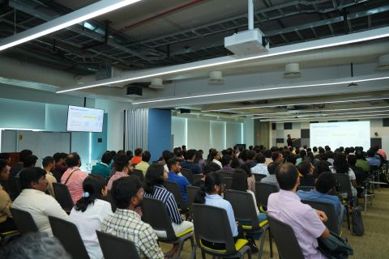
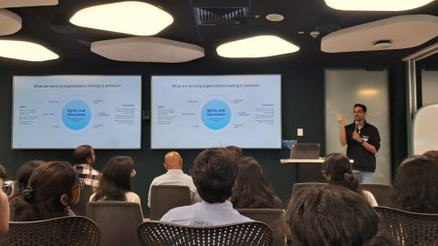

At SAP Inside Track Bengaluru, I got to connect with the community and speak about a topic I am quite passionate about: how agentic AI is changing the DNA of software development and architecture.

The core of the discussion was this: our roles are shifting from taking instructions to giving them. But simply mastering prompts is not enough to evolve. To really lead in this shift, we still need to be developers by heart, have strong domain understanding, understand the application SDLC, and know where AI tooling actually fits.

The good news is that AI makes this more accessible too. It can help us learn faster, explore more deeply, and move across areas that earlier felt too far away. But the fundamentals still matter. Maybe even more now.

The energy and questions after the session were really encouraging. I also got the opportunity to give a separate session for students on SAP BTP, which made the whole experience even better.

## Photos

