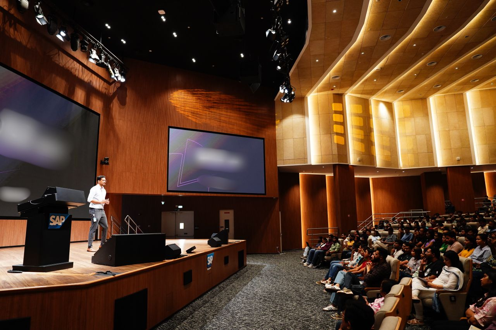
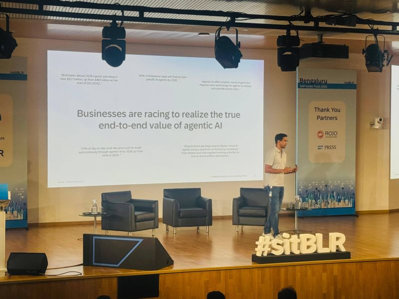

Over the last few weeks, I got to speak about two interesting AI topics at SAP's Learning Fest with SAP colleagues, and at SAP Inside Track with customers, partners, and the wider SAP community.

The first topic was SAP's AI-native North Star, the architecture vision for the autonomous enterprise.

The second was AI Golden Path, the practical guide to building AI applications and agents, and how we can move closer to SAP's AI-native vision in a more practical way.

It was great to be back speaking at SAP Inside Track and interacting with the community again. Looking forward to seeing how our customers and partners build AI-native applications and agents.

## References

- [AI-Native North Star Architecture](https://architecture.learning.sap.com/docs/ai-native-north-star-architecture)
- [AI Golden Path](https://architecture.learning.sap.com/docs/ai-golden-path)

## Photos

