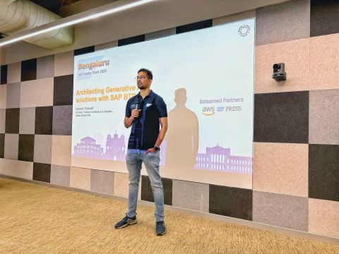
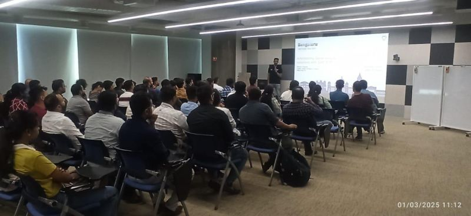

It had been a while since I last spoke at SAP Inside Track, so it felt good to be back as a speaker at SAP Inside Track Bengaluru.

I presented a session on architecting generative AI solutions with SAP BTP and open source tools.

The useful part of the topic, at least for me, was looking beyond the AI demo and thinking about the actual architecture. How do platform services, open source components, integration points, security, and orchestration come together in a way that is useful for real enterprise scenarios?

SAP Inside Track sessions are always special because the conversations are practical and community-driven. You get to share what you are learning, but also hear how others are thinking about the same problem from their own projects and context.

## Photos

