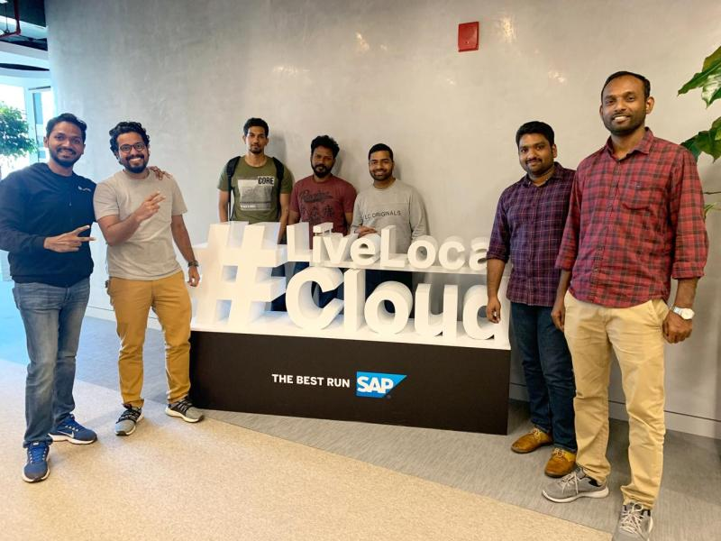
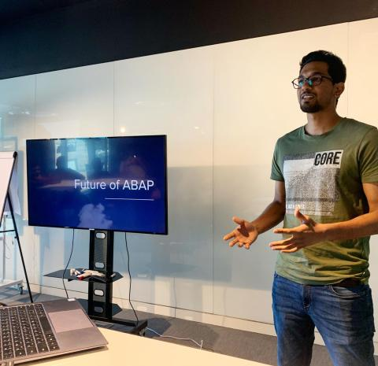
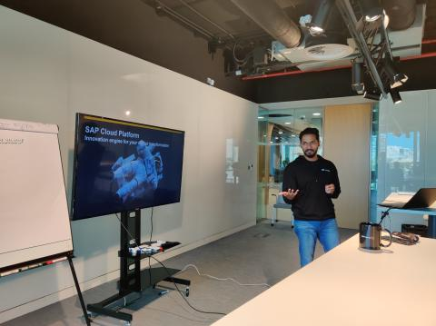
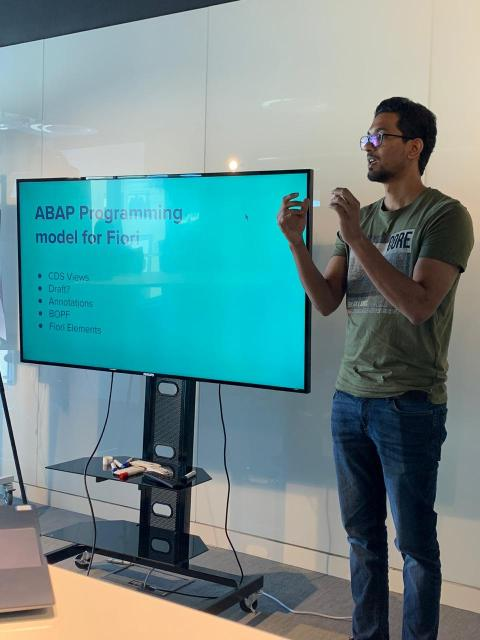

At a SAP Yalsah meetup, I presented on the "Future of ABAP."

The meetup also had sessions on SAP Cloud Platform by Midhun VP and mobilizing Fiori with Cordova by Sreehari Pillai.

Looking back, this is a nice early speaking and community entry because it shows a thread that still continues for me: SAP technology, community learning, and trying to make platform shifts easier to understand.

## Photos

