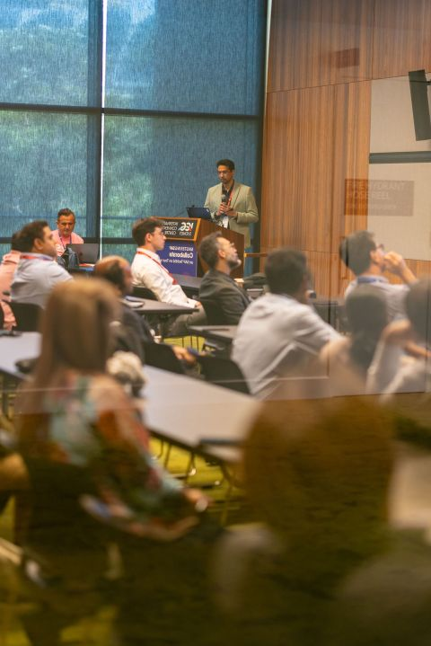
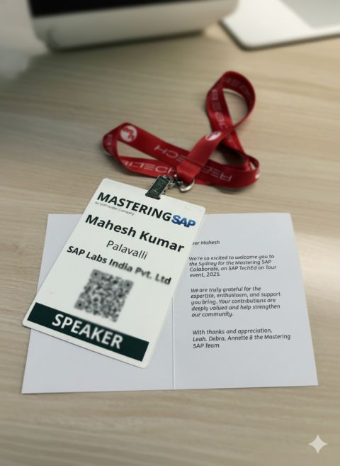

It is easy to build an AI demo that works once, but much harder to build custom AI applications and agents that are secure, grounded, and resilient at scale.

At MasteringSAP in Sydney, I had the opportunity to present two sessions that sat exactly in that gap between a cool experiment and enterprise reality.

The first session was on building custom AI applications at scale with SAP Generative AI Hub. The discussion focused on staying model agnostic through a unified API, while the heavy lifting around orchestration, security guardrails, grounding, and data masking happens in the middle layer where enterprise architecture really matters.

The second session was on evals and benchmark engineering. Generic benchmarks are useful, but they are not enough when the real question is whether a model or agent works for your business process, your data, your risk profile, and your users.

For me, both sessions connected to the same practical point: AI architecture is not just about picking a model. The real work starts around orchestration, grounding, evaluation, security, and the operating model that lets teams improve safely over time.

## Photos

