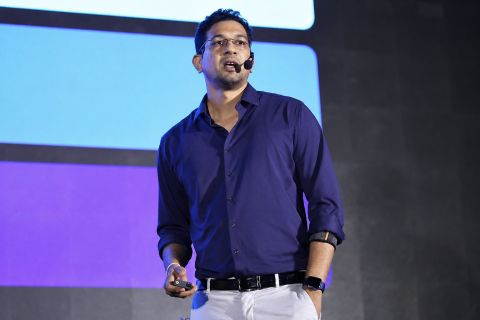
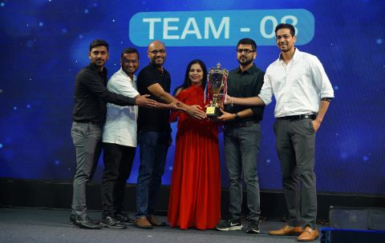

So recently I got to present SAP's AI-Native strategy along with my colleagues Ajit Kumar Panda and Praveen Padegal at the AI Innovation Camp in Goa.

The session was on how different stacks across SAP will and should evolve as we move towards an AI-Native enterprise architecture. Not just AI use cases on top, but what changes in the way we think about applications, platform, data, integration, and engineering when AI becomes a more native part of the enterprise stack.

What I enjoyed most were the conversations that followed. Colleagues connected it back to their own teams and work, there were some really good questions, and the follow-up discussions went well beyond the session itself.

And of course, the hackathon was the cherry on top. I got a chance to be part of the jury and saw some really interesting use cases. Also, after a long time, it was nice to step out of the regular work rhythm and spend focused time learning, sharing, and exchanging ideas with others. Goa made that even better.

Thanks to Poornanand Kulkarni, Kumari Supriya, and the other amazing colleagues for putting together such a thoughtful experience.

## Photos

