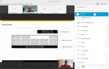

I gave a session called "SAP Community as your Learning Strategy."

The session was about free SAP, SAP Community, and openSAP resources that people could use to continue learning, especially during the COVID period.

This topic is quite close to how I have learned many SAP topics myself over the years: through community blogs, questions, examples, sessions, and free learning material.

The presentation was made using reveal.js, and the original LinkedIn post also pointed to the session link.

## LinkedIn preview

