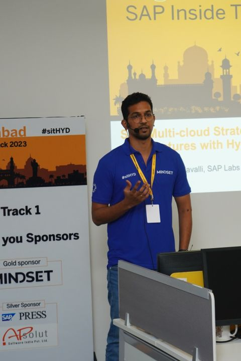
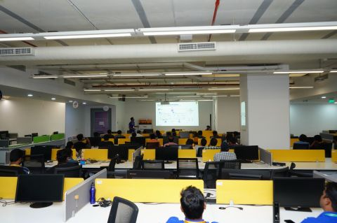
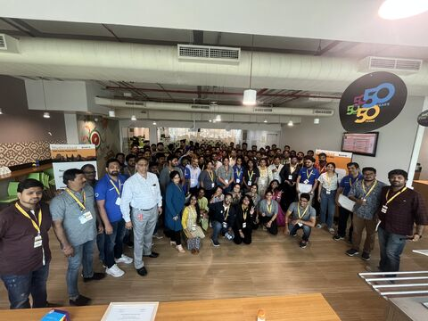
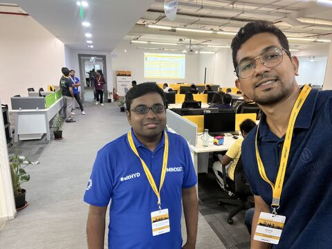

At SAP Inside Track Hyderabad, I had the opportunity to present a session on SAP Multi-cloud Strategy and Reference Architectures with Hyperscalers.

It was a great experience speaking with customers and partners about SAP BTP, along with my colleague Praveen Kumar.

The session was about making multi-cloud and hyperscaler conversations more concrete through reference architectures, SAP BTP use cases, and practical architecture patterns.

Thanks to the core team, including Ruthvik Chowdary and Poonam Goje Singh, for driving the event and making it a success.

## Photos

