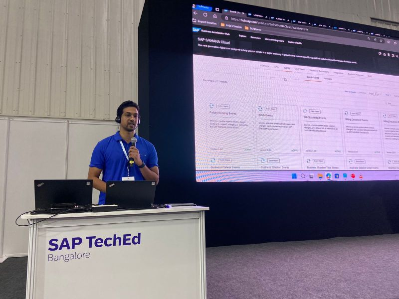
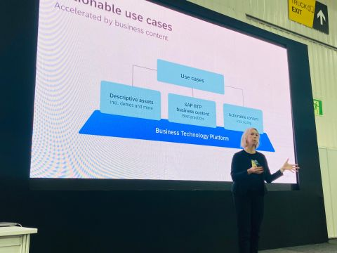
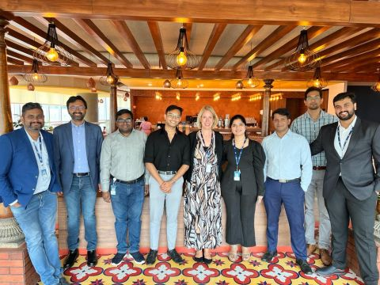
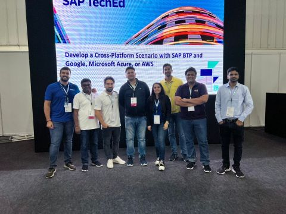

SAP TechEd 2023 was a special week for me.

I got the opportunity to present at the Strategy Talks alongside Anja Schneider, and I was also part of a hands-on session and several demo booths related to SAP BTP use cases and reference architectures.

What made it even better was working closely with Aryan Raj Sinha, Lalit Mohan, Vedant Gupta, Praveen Kumar, Kay Schmitteckert, Chaturved Akash Amarendra, Ajit Kumar Panda, Navya Khurana, Uma Anbazhagan, Uwe Klasing, Swati Maste, and ShanthaKumar Krishnaswamy.

As a first-time speaker at TechEd, the experience was genuinely memorable. I especially enjoyed the conversations with customers and partners around SAP BTP, because that is where reference architectures become more than diagrams and start connecting to real use cases.

## Photos

