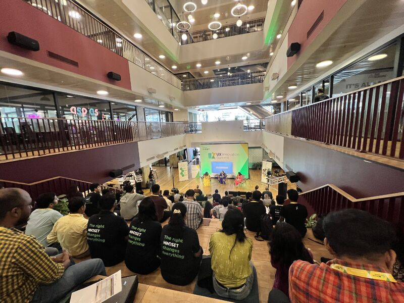
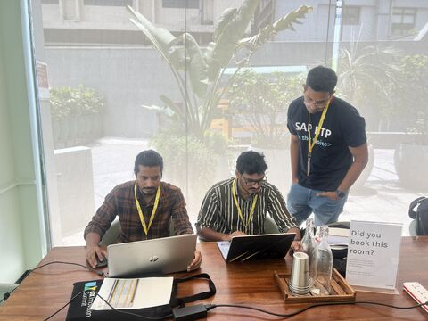
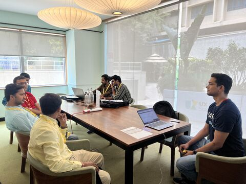
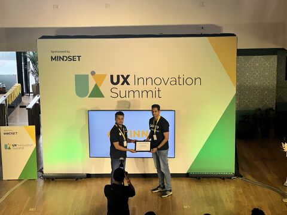

The UX Innovation Summit was a wonderful SAP Community event organized by Mindset Consulting.

It was great listening to the keynote panel discussion from Parvathy Sankar, Uma Rani, and Mrudula Sreekanth, especially around the role of UX in the SAP world.

I also had the opportunity to conduct a hands-on session showcasing our SAP Datasphere use case and reconnect with many familiar faces from SAP Community.

Overall, it was a really good community experience. Thanks to Parvathy Sankar, Kamalika Bhar, and the Mindset team for organizing the event and creating a platform for these conversations.

## Photos

